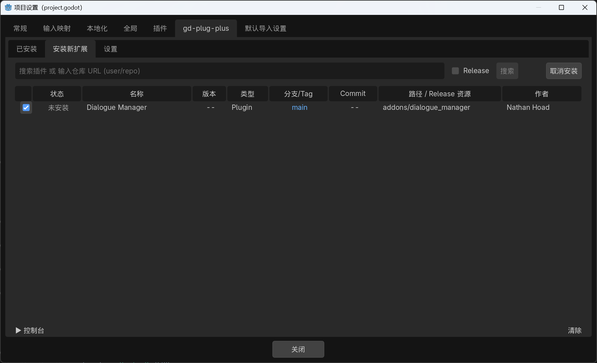
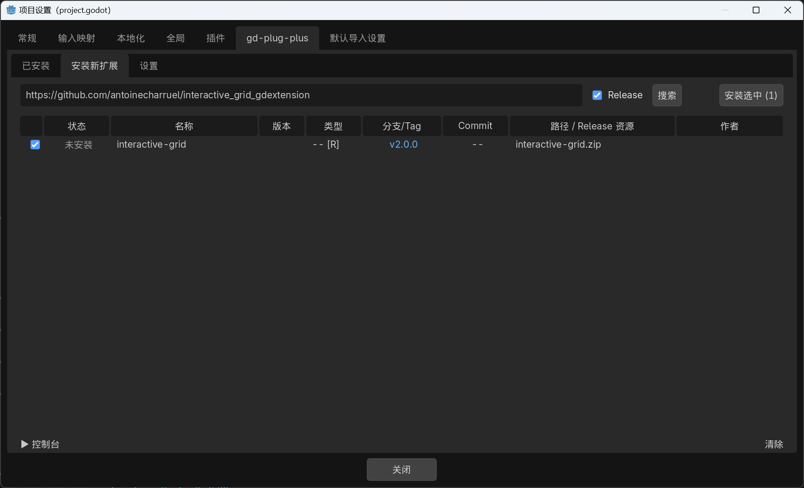
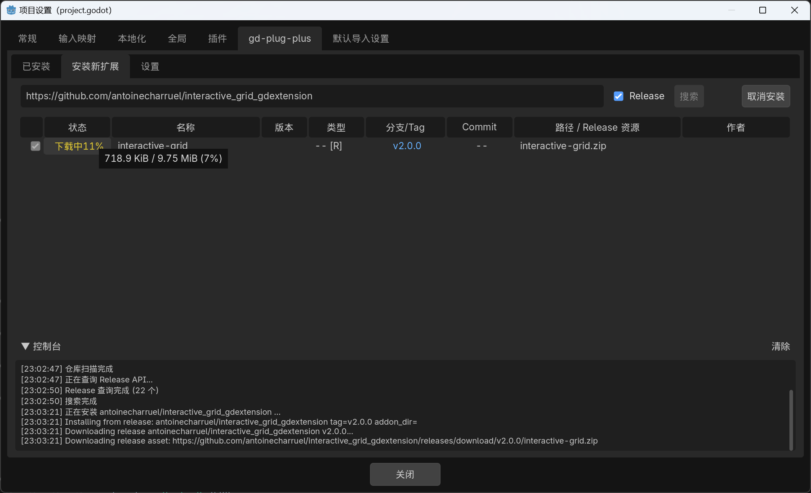
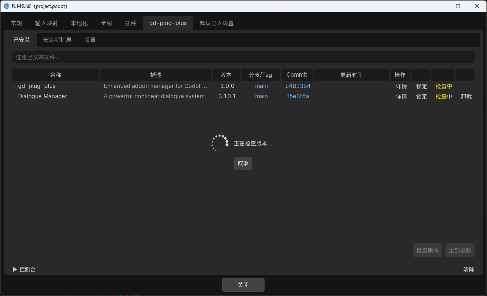
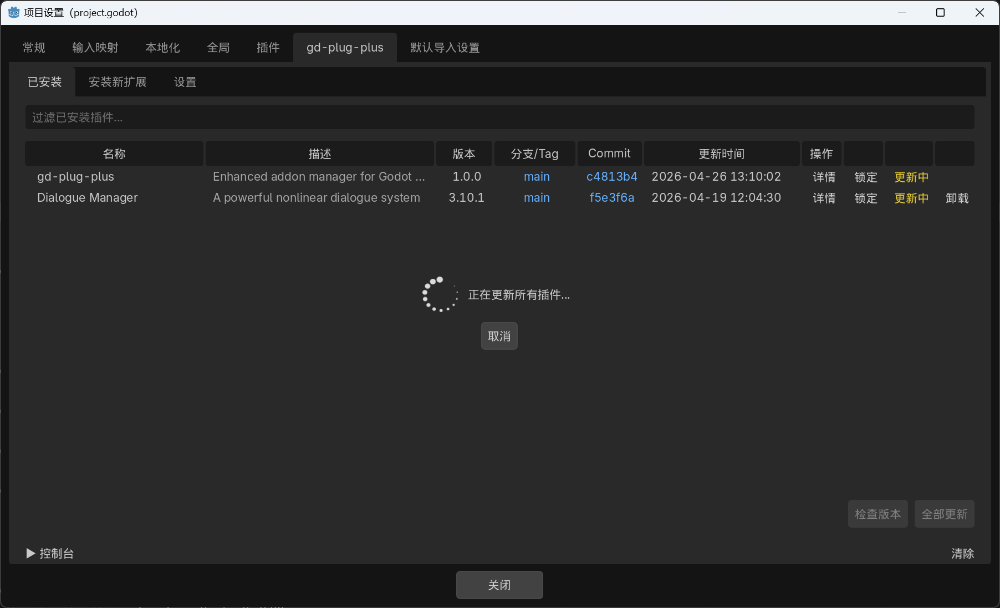
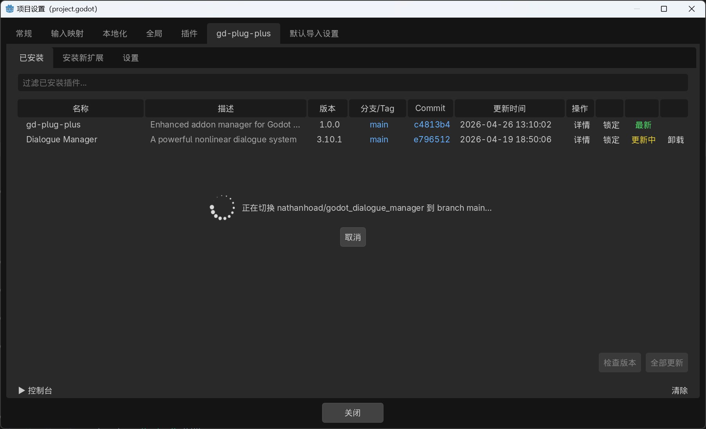
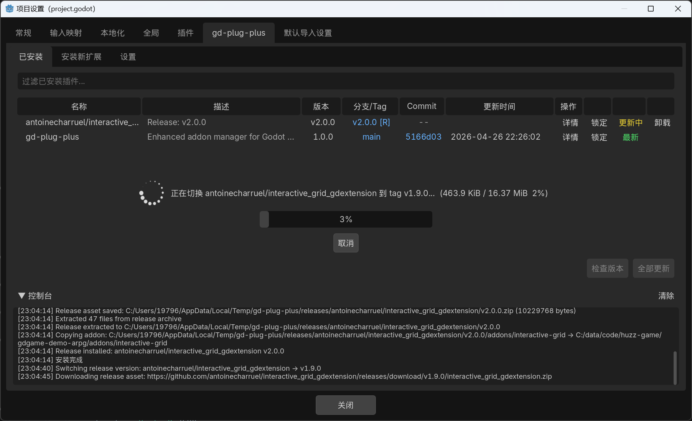

# gd-plug-plus

**[English](README.md) | 中文**

Godot 4.x 插件管理器，内置编辑器 UI。在编辑器内浏览、安装、更新和锁定插件版本，无需编写配置脚本。

## 环境要求

- **Godot 4.x**（4.4+ 测试通过）
- **git** 已添加到系统 `PATH`

## 安装

将 `addons/gd-plug-plus/` 复制到项目的 `addons/` 目录，然后在 **项目 → 项目设置 → 插件** 中启用。

## 使用方法

### 安装插件

切换到 **安装新扩展** 选项卡。内置目录列出了可一键安装的社区插件，也可以在搜索栏输入 Git URL 后点击 **搜索** 来查找任意公开仓库。

勾选需要的插件，点击 **安装选中** 即可。



### 从 Release 安装 GDExtension

部分插件（尤其是 GDExtension）以预编译二进制的形式通过 GitHub Releases 发布，而非源码。

1. 输入仓库 URL，勾选 **Release** 复选框，点击 **搜索**



2. 勾选搜索结果，点击 **安装选中** — 资源将实时显示下载进度，下载完成后自动解压并复制到项目中



### 检查版本更新

在 **已安装** 选项卡中，点击 **检查版本** 按钮，对比所有已安装插件与远程仓库的最新状态。有新提交的插件会显示 **更新** 按钮。



### 全部更新

点击 **全部更新**，一次性拉取所有插件的最新更改。



### 切换版本

点击已安装插件的分支/Tag 或 Commit 链接，可以切换到不同的分支、标签或特定 commit。



### 切换 Release 版本

对于从 Release 安装的插件，点击标签链接（如 `v2.0.0 [R]`）可以切换到其他 Release 版本。新版本资源将被下载并替换旧版本，支持进度显示和取消操作。



### Token 配置

Release 搜索和下载需要平台 API 令牌（避免速率限制，同时支持私有仓库访问）。令牌存储在 **项目外部的加密文件** 中，同一台机器上的所有 Godot 项目共享。

前往 **设置 → 认证** 配置令牌：

| 平台 | 认证方式 | 获取方式 |
|---|---|---|
| GitHub | Device Flow OAuth / PAT | [github.com/settings/tokens](https://github.com/settings/tokens) |
| Codeberg | PAT | [codeberg.org/user/settings/applications](https://codeberg.org/user/settings/applications) |
| Gitee | PAT | [gitee.com/profile/personal_access_tokens](https://gitee.com/profile/personal_access_tokens) |

- **Device Flow**（仅 GitHub）：点击"Device Flow 登录"，界面显示验证码 — 打开浏览器链接、输入验证码、授权后令牌自动保存。
- **PAT**（所有平台）：将 Personal Access Token 粘贴到输入框并点击保存。

令牌文件位置：`$XDG_CONFIG_HOME/gd-plug-plus/tokens.dat`（Linux/macOS）或 `%APPDATA%/gd-plug-plus/tokens.dat`（Windows）。

### 代理配置

前往 **设置 → 网络** 配置 HTTP/HTTPS 代理。启用后，代理将应用到所有网络请求 — 包括 Godot HTTP 请求和 git 子进程命令。

## 参与贡献

### 插件目录

**安装新扩展** 选项卡中的内置插件目录由 [`addon_index.json`](addons/gd-plug-plus/addon_index.json) 驱动。任何人都可以贡献新条目：

1. Fork [gd-plug-plus 仓库](https://github.com/huzz-open/gd-plug-plus)
2. 编辑 `addons/gd-plug-plus/addon_index.json`
3. 按以下格式添加条目
4. 提交 Pull Request

#### 格式

`addon_index.json` 是一个 JSON 数组，每个元素代表一个仓库：

```json
[
  {
    "url": "https://github.com/user/repo",
    "addons": [
      {
        "name": "我的插件",
        "description": "一行简短描述。",
        "addon_dir": "addons/my_plugin",
        "author": "作者",
        "type": "plugin",
        "branch": "main"
      }
    ]
  }
]
```

#### 字段说明

| 字段 | 必需 | 说明 |
|---|---|---|
| `url` | 是 | 完整的 git 克隆地址 |
| `addons` | 是 | 该仓库中的插件数组 |
| `addons[].name` | 是 | 显示名称 |
| `addons[].addon_dir` | 是 | 安装目标目录（如 `addons/my_plugin`） |
| `addons[].branch` | 是 | 默认分支（如 `main`） |
| `addons[].description` | 否 | 一行描述 |
| `addons[].author` | 否 | 作者名 |
| `addons[].type` | 否 | `plugin`（默认）或 `gdextension` |

多插件仓库中，每个插件作为 `addons` 数组中的独立元素列出。

## 致谢

gd-plug-plus 参考了 [imjp94](https://github.com/imjp94) 的两个项目：

- [gd-plug](https://github.com/imjp94/gd-plug) — Godot git 插件管理器（MIT）
- [gd-plug-ui](https://github.com/imjp94/gd-plug-ui) — gd-plug 编辑器 UI（MIT）

## 许可证

[Apache-2.0](LICENSE)
